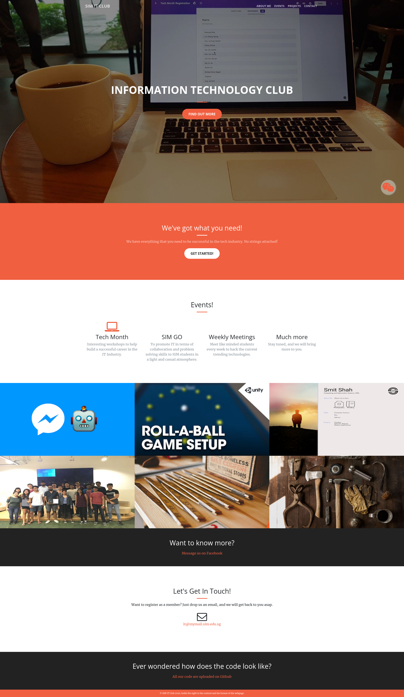

# SIMITClub.github.io

Second iteration of the club website, preserved for posterity.

## Overview

The site is a static single page built with Bootstrap.

To view the site, clone the repository and open [`index.html`](./index.html) in a browser.

## Screenshot

## Contributing

### Fixes

Feel free to submit a PR for any fixes or improvements. \
Alumni from the club are especially welcome to contribute.

### Other iterations (2010-2016 / 2020-2021)

Create a branch from `v2` and submit a PR.