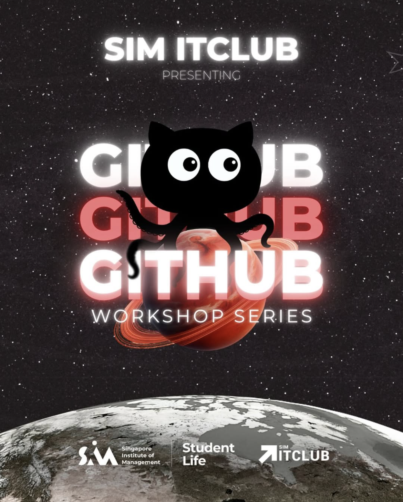
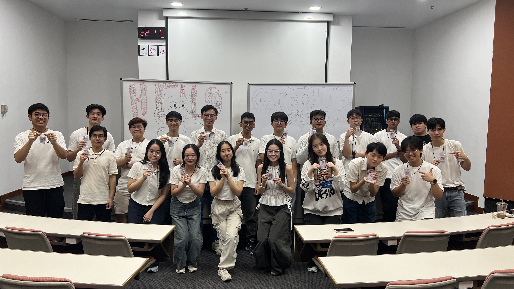
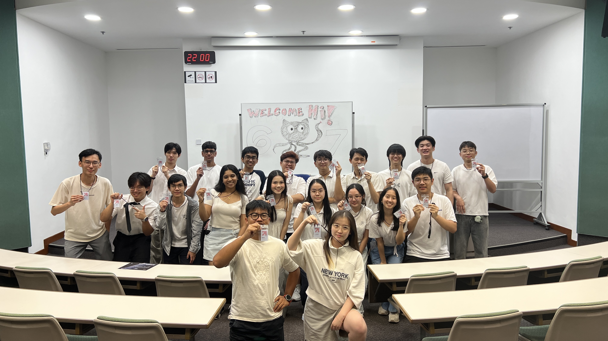
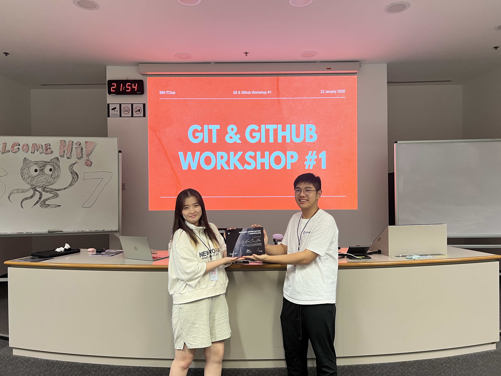

Writing code is important, but managing code changes and collaborating effectively are what make projects truly successful. 🚀

SIM IT Club was proud to host a 2-Part GitHub Workshop, catering to both beginners who are just starting out and more advanced students looking to deepen their GitHub skills.

## Workshop Sessions

### 🔰 Session 1: Github Basics
- **Date:** 22nd January 2026
- **Time:** 07.00 PM - 10.00 PM
- **Location:** A.3.08

### 🚀 Session 2: Github Advanced
- **Date:** 29th January 2026
- **Time:** 07.00 PM - 10.00 PM
- **Location:** A.4.08

During the workshop, students learned essential Git commands, how to work with GitHub repositories, track code changes, and collaborate on team projects. These are fundamental skills for anyone stepping into the world of software development. 💻

This workshop wouldn’t have been possible without our amazing speakers, **Hae Eun Lee** and **Nadon Panwong**, who generously shared their knowledge through practical demonstrations.

A big thank you as well to our dedicated facilitators and supporters who helped ensure everyone could follow along:

- SIMGE (SIM Global Education)
- Desmond
- Fukutaro Sie
- Michelle Chan
- Reynaldi Ardianto W.
- Vanness Yang
- Yan Mei W.
- Stanley Laurenz
- Albert Librantono
- Eugene Caesar
- Gerald Chua
- Helen Priyatna
- Kimberly Goh
- Moe Pye Sone
- Mohamed Ameer
- Nityashri Meka
- Paing Thit Xan
- Tan Weiquan
- Vicky Yang
- Vun Kian Hiung
- Alex

We hope this workshop empowered students to start using GitHub in their projects and continue building their development skills. 🙌

Stay tuned for more exciting tech events coming your way! 💫
