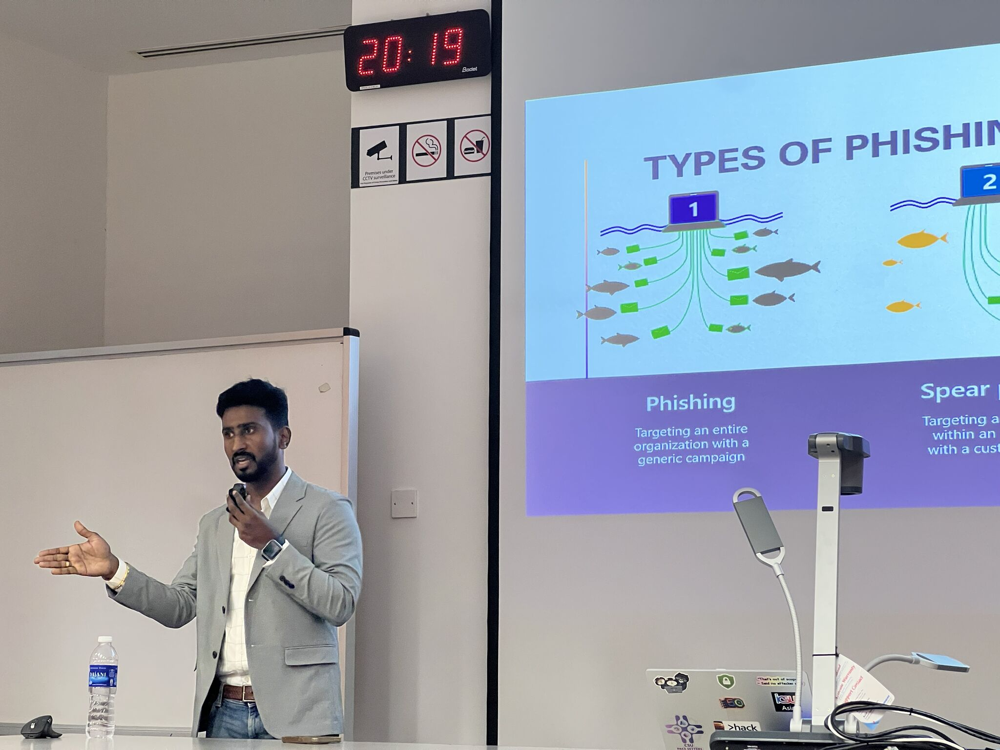

🔐 **Cybersecurity Workshop: Staying Safe in a Digital World** 🚨

With recent scam emails circulating around, it was a timely reminder of how important cyber awareness is in today’s digital landscape.

SIM IT Club was proud to host an insightful Cybersecurity Workshop, featuring **Balamurugan Narayanan**, Security Advisor at Microsoft 🎉

During the session, we gained valuable insights into why cybersecurity matters more than ever, Microsoft’s approach to securing digital ecosystems, and how cybersecurity continues to shape trust and safety in the digital age.

A big thank you to our speaker, Mr. Narayanan, and everyone who attended and made the session a great success!

A big thank you as well to our facilitators:
- **SIMGE (SIM Global Education)**
- **Desmond -**
- **Fukutaro Sie**
- **Michelle Chan**
- **Reynaldi Ardianto W.**
- **Vanness Yang**
- **Winston Faustin**
- **Yan Mei W.**

Your guidance and support played a huge role in making this session impactful for our students.

We hope the workshop empowers you with greater awareness and practical takeaways to stay cyber-safe. 🙌

Stay tuned for more tech events coming your way. 💫
